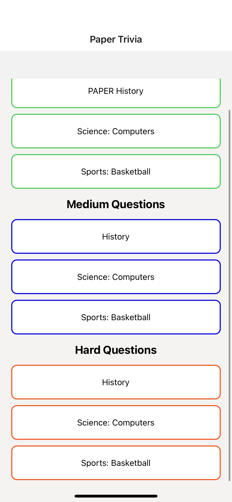
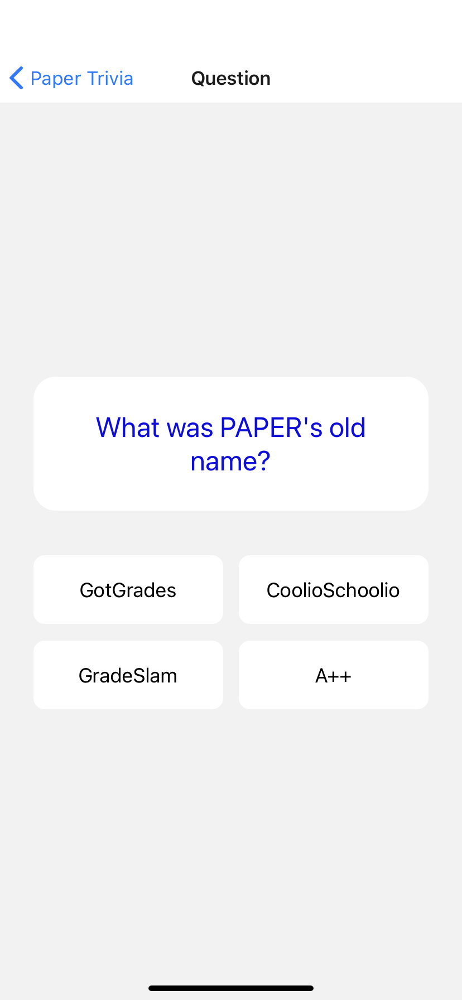
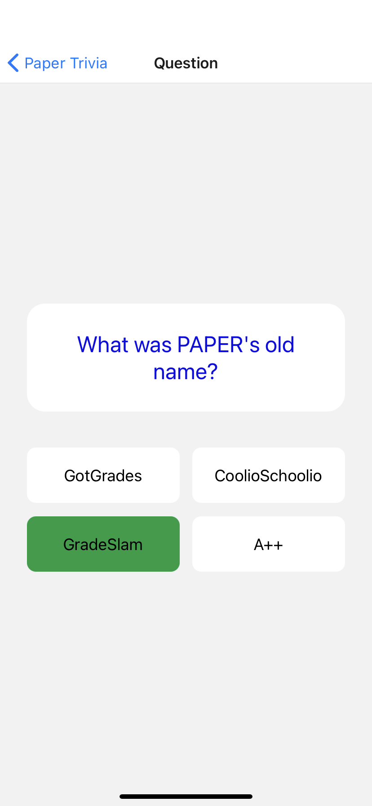

# Paper React Native Test
## Guidelines
- The specifications of the problem are listed below. Please read **all instructions carefully**
- You can create as many files as you like. 
- All implementation code should be in the `src` folder
- Do not worry about getting the exact dimesions and spacing. Just try to get it as close to the mockups as possible.

## Dev Environment

At PAPER we do not use *Expo*, but for simplicity, it is used in this assessment

## Evaluation Criteria

1. Code readability and organization
2. Problem solving skills
3. Understanding of React concepts
4. How well the guidelines provided were followed

## Submission Instructions
- Fork this project 
- Create a branch off main, for this test, call it `${firstName}-${lastName}`
- Make a pull request in your forked repo back to main

# Assessment: Trivia App 

## API Instructions
Your goal is to create a very basic trivia app. We will be using data from [Open Trivia Database](https://opentdb.com/api_config.php)

When consulting the API, make sure to follow these guidelines when generating the API endpoint we want to call
- Number of questions : 10
- Any category
- Any difficulty
- Any Type
- Default Encoding

## Mobile App Instructions

### List Screen
- When loading the app, the user should be redirected to the ***list screen***
- With the response that you receive from the API, you are to create a ***scrollable list of all the questions***.
- The questions are divided based on their difficulty: ***easy, medium & hard***
- The question box displays the ***category*** of the question
- When clicking a box, it should ***redirect the user to the question screen***

### Question Screen
- It displays the ***question and the choices***. The question can either have ***4 multiple choices*** or be a ***true/false*** question
- When clicking on a choice, the box should ***change background color***. If its `correct = Green`, `incorrect = Orange`. When selecting a new box, the ***other boxes' background color should return to the default color (white)***

### Color Codes
Use these codes for the colors displayed on the mockup
- Blue: `#0e0fe0`
- Green: `#009D40`
- Orange : `#FF570D`
- Grey: `#f4f3f1`

### Packages 
You will use the following packages to fullfill the requiremets
- [Axios](https://github.com/axios/axios) for making API calls
- [React Navigation](https://reactnavigation.org/docs/navigating) to move between screens

***These packages are already added to the `lock` and `package.json` files*** on the `main` branch

# Mockups
## There is a live video demo of the app located in the `public` folder! Make sure to take a look to understand the exact behavior!

# Important Notes
*If I were to change my input in the API, eg. I choose only multiple choice questions OR I choose 30 questions, your app should still behave the same and not crash*
